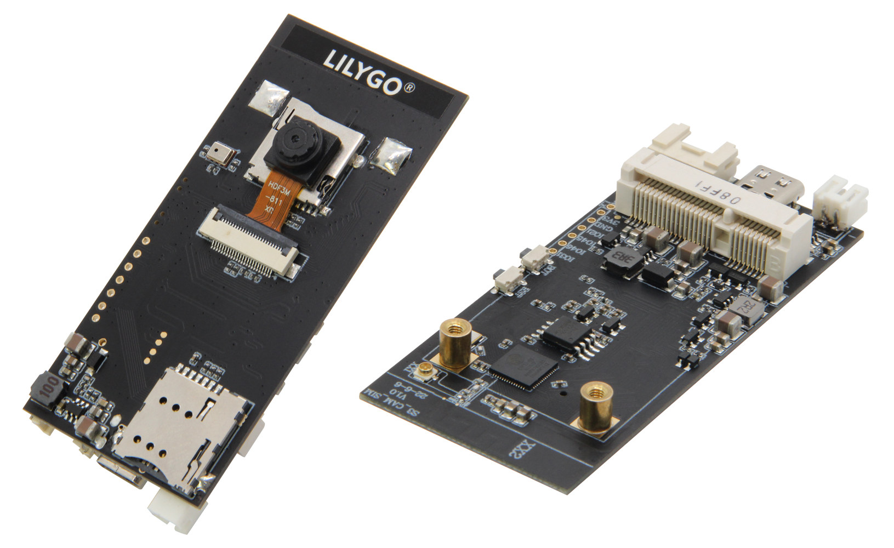
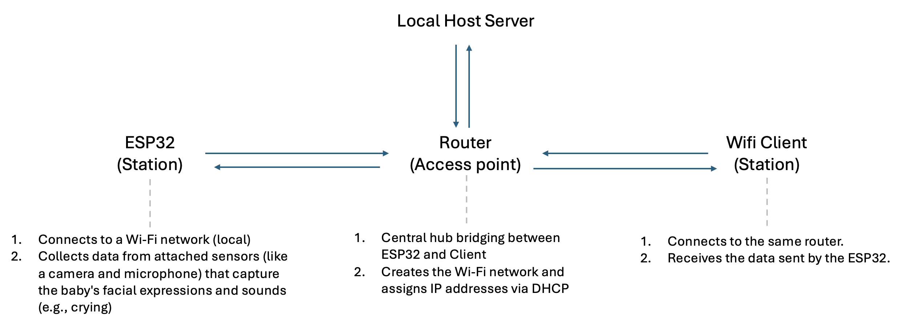

# ict720_software_2025_baby_observation

  

## Member:
1. Nattapol TAPTIENG (zaku.capzicumz@gmail.com) --> _[Project_Manager]_
2. Sela VAN --> _[Web_Development]_
3. Yanavut CHAWAPHANTH --> _[Image_Object_Detection]_

## Domain: Baby Observation (There...There...🥰)

## User Story:
As a parent, I want a smart and attentive companion that continuously watches over my baby. Whenever my baby wakes, cries, or behaves unusually, I need to be instantly alerted, no matter where I am in the house or outside. This way, I can quickly comfort and ensure my baby's safety, giving me peace of mind and confidence to handle daily tasks without worry.

## 1. **Introduction**
Have you ever wanted to spend the night without your adorable, lovely, fragile baby? (Let's have some space between us!) 😗

## 2. **Objective**
- Ensure the status of the baby while parents are in the different rooms or during the nighttime.
- To detect facial expression analysis of the baby _(identifying crying or distressed facial cues)_
- To detect sound detection of the baby _(microphone data to detect crying sounds)_

## 3. **Hardware**

The T-SIMCAM ESP32-S3 CAM is a versatile development board designed by LilyGO, featuring the ESP32-S3 microcontroller. It integrates a camera, wireless connectivity, and expansion options, making it suitable for IoT, computer vision, and edge computing projects.

<!--  -->
<!-- img src="images/ESP32-S3-camera-board.jpg" width="600" -->
<!-- to adjust the width and position "center", "left", or "right" -->

  

**T-SIMCAM ESP32-S3 CAM Hardware Specification**

**Microcontroller Unit (MCU)**
- Model: ESP32-S3R8
- Architecture: Dual-core Xtensa LX7 microprocessor
- Clock Speed: Up to 240 MHz
- Memory:
  - RAM: 8 MB PSRAM
  - Flash Storage: 16 MB QSPI flash
- Wireless Connectivity:
  - Wi-Fi: IEEE 802.11b/g/n (2.4 GHz)
  - Bluetooth: Version 5.0 LE and Mesh

**Camera**
- Sensor: OV2640
- Resolution: 2 Megapixels (1622×1200)
- Frame Rate: Up to 60 fps

**Audio**
- Microphone: I2S digital microphone (MSM261S4030H0R)
- Microphone Module
  - Connects to the ESP32’s ADC1 pins (best result)
  - ADC operates between 0 V and ~3.3 V.

image source: https://lastminuteengineers.com/esp32-pinout-reference/

**Expansion and Connectivity**
- MicroSD Card Slot: Supports external storage
- mPCIe Socket: Optional cellular modules (NB-IoT, 2G GSM, 3G/4G LTE)
- SIM Card Slot: Nano-SIM compatibility (requires additional mPCIe module)
- Grove Connector: For easy sensor integration
- USB Port: 1x USB Type-C for power and programming

**Power Supply**
- USB-C Port: 5V DC input
- Battery Support: 2-pin JST connector for LiPo batteries
- Charging Chip: TP4056, supports up to 580 mA charging current

**Dimensions**
- Size: 82 x 35.5 x 12 mm

## 4. **Software**

## 5. **Network and Connection**
- Station Mode

Why Wi-Fi?

## 6. **Approach**
- ESP32 with external processing unit
- ESP32 (C/C++) → Communication Layer (e.g. MQTT) → ML Processing (Python)

## 7. **Reference**
- Buy T-SIMCAM (ESP32-S3) at: https://lilygo.cc/products/t-simcam
- How to use ESP32-S3: https://randomnerdtutorials.com/

## 8. **Data Approach**

